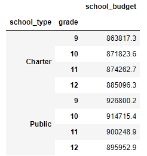
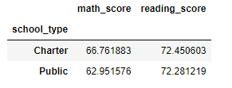

# School_District_Analysis
Module 4

## Summary of Findings
This analysis was performed to better understand the relationships between student grades in math and reading and the school size, type and spending per student. However, there seems to be a disconnect between each Deliverable in what exactly we are trying to determine. Based on data from Deliverable 5, it is found that average math scores do significantly increase based on budget for each school. We can see the data in our comparison below between our school_type and math_score table and our table for school_budget for each school type. 
                                                              
        
 
 
 
The findings above indicate that there are more relevant factors than budget that decide average student scores. From the data, we can see some increase in math scores in charter schools, though their budget is much less than public schools, but it may be worthwhile to complete a side-by-side analysis of math scores for each school and grade. By performing this additional analysis on specific schools, we may be able to determine if there is data that is skewing our results, then taking additional steps to remove/replace outliers from the data. 
 
 
